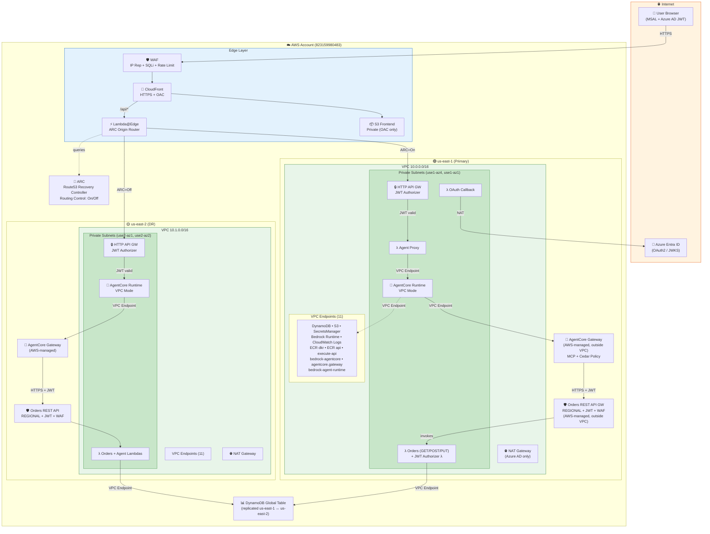

# Security Architecture — Secure Agentic App (Project Redwood)

> Multi-region deployment with VPC isolation, JWT auth, WAF, and ARC failover

---

## Architecture Diagram



---

## Security Controls Summary

| Layer | Control | Effect |
|-------|---------|--------|
| **Edge** | CloudFront + WAF | Blocks malicious IPs, SQLi, rate abuse |
| **API Auth** | JWT Authorizer (Azure AD) | Unauthenticated requests → 401 |
| **Network** | VPC + Private Subnets | No public internet for compute |
| **Endpoints** | 11 VPC PrivateLink endpoints | All AWS API calls stay private |
| **Compute** | Lambda + Runtime in VPC | ENIs in private subnets only |
| **Data** | DynamoDB Gateway Endpoint | No public endpoint access |
| **Secrets** | Interface Endpoint + Scoped IAM | Private access, specific ARNs |
| **CORS** | Restricted to CloudFront domain | Cross-origin attacks blocked |
| **Failover** | ARC + Lambda@Edge | Sub-minute DR activation |
| **Policy** | Cedar Policy Engine | Fine-grained tool-level access control |

---

## Traffic Paths

### ✅ Private Traffic (inside VPC)
- Agent Proxy Lambda → AgentCore Runtime (via `bedrock-agentcore` endpoint)
- Runtime → Gateway (via `bedrock-agentcore.gateway` endpoint)
- Orders Lambdas → DynamoDB (via Gateway endpoint)
- All Lambdas → Secrets Manager (via Interface endpoint)
- Runtime → Bedrock LLM (via `bedrock-runtime` endpoint)
- All Lambdas → CloudWatch Logs (via Interface endpoint)

### ⚠️ Controlled Public Traffic (secured by auth)
- AgentCore Gateway → Orders API (JWT + WAF protected, REGIONAL endpoint)
- OAuth Callback → Azure AD (via NAT Gateway, required for 3-legged auth)
- User → CloudFront (HTTPS, WAF filtered)

---

## Multi-Region Failover

```
Normal Operation (ARC = On):
  User → CloudFront → Lambda@Edge → us-east-1 API

Failover (ARC = Off):
  User → CloudFront → Lambda@Edge → us-east-2 API

Recovery (ARC = On again):
  User → CloudFront → Lambda@Edge → us-east-1 API
```

**Failover time:** < 30 seconds (Lambda@Edge queries ARC on every /api/* request)

---

## Cost (per region, monthly)

| Resource | Cost |
|----------|------|
| NAT Gateway | ~$32 |
| 9 Interface VPC Endpoints | ~$63 |
| WAF WebACL | ~$5 |
| ARC Cluster (shared) | ~$1,800 |
| **Total per region** | **~$100** (excl. ARC) |
